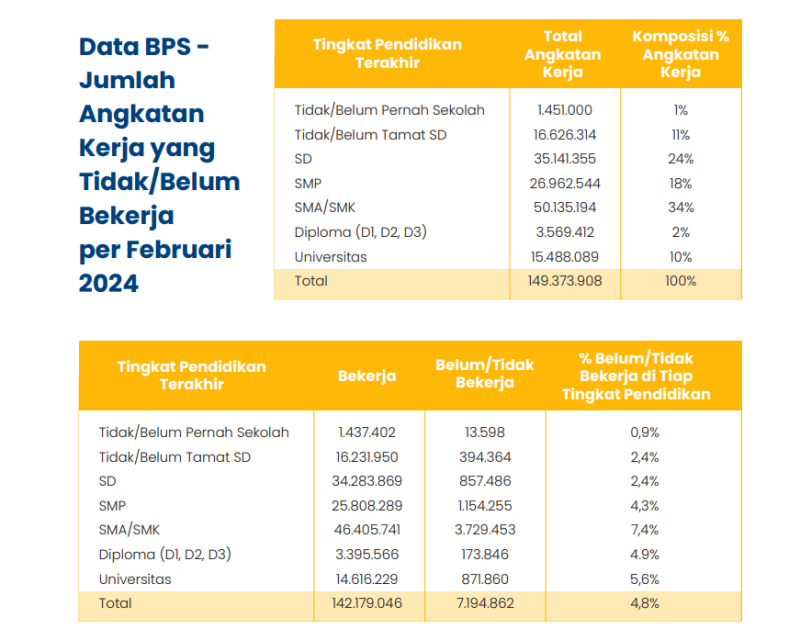

# karir.ai

## Septian Eka Rahmadi - 22/496732/TK/54442
## Muhammad Luthfi Attaqi - 22/496427/TK/54387
## Shafa Aura Yogadiasa - 22/496508/TK/54406

## Project Senior Project TI

## Departemen Teknologi Elektro dan Teknologi Informasi, Fakultas Teknik, Universitas Gadjah Mada

## Nama Produk: karir.ai

## Latar Belakang:
Banyak individu, terutama fresh graduate dan profesional muda, mengalami kesulitan dalam menentukan jalur karir yang sesuai dengan pengalaman dan keterampilan yang mereka miliki. Selain itu, Job mismatch yang merupakan fenomena ketika kualifikasi, keterampilan, atau minat pekerja tidak sesuai dengan pekerjaan yang mereka jalani kerap kali dirasakan. Di Indonesia, masalah ini telah menjadi perhatian serius, terutama karena dampaknya terhadap produktivitas, kesejahteraan pekerja, dan pertumbuhan ekonomi.  

Berdasarkan hasil laporan  “Fenomena Job Mismatch di Indonesia,” Menteri Ketenagakerjaan  (Menaker)  Periode 2019-2024, Ida Fauziyah menduga terdapat banyak penduduk muda Indonesia berusia 15-24 tahun atau Generasi Z yang menganggur tengah dalam proses mencari pekerjaan.  

 

Sumber Grafis: Populix, Sumber Data: BPS 

Berdasarkan hasil survei Populix, sebanyak 30% responden pencari kerja menyatakan bahwa mereka memiliki latar belakang pendidikan yang tidak sesuai dengan pekerjaan yang akan mereka lamar. Oleh karena itu, dibutuhkan solusi berbasis AI yang dapat membantu individu memahami potensi mereka dan merekomendasikan jalur karir terbaik berdasarkan lowongan pekerjaan yang tersedia. 

## Permasalahan:
1. Bagaimana cara membantu individu, terutama fresh graduate dan profesional muda, dalam memahami keterampilan utama yang mereka miliki berdasarkan resume mereka? 
2. Bagaimana cara mencocokkan pengalaman dan keterampilan individu dengan peluang kerja yang tersedia di pasar kerja secara akurat? 
3. Bagaimana cara memberikan rekomendasi jalur karir yang lebih sesuai dengan profil pengguna menggunakan kecerdasan buatan? 
4. Bagaimana cara meningkatkan pemahaman individu terhadap potensi karir mereka melalui platform berbasis AI? 

## Ide Solusi:
karir.ai sebagai sebuah platform web berbasis AI yang dapat menganalisis resume pengguna untuk memberikan rekomendasi karir yang sesuai. Dengan memanfaatkan Natural Language Processing, yaitu sentence-BERT dengan all-MiniLM-L6-v2 dan paraphrase-MiniLM-L6-v2. Nantinya, platform ini dapat membaca dan memahami pengalaman pengguna berdasarkan resume yang diberikan, kemudian mencocokkannya dengan pekerjaan yang sesuai berdasarkan data dari lowongan kerja yang tersedia.

## Analisis Kompetitor
**KOMPETITOR 1**

| **Nama** | LinkedIn Job Recommendations |
|----------|------------------------------|
| **Jenis Kompetitor** | Indirect |
| **Jenis Produk** | Platform *social media* dengan fitur rekomendasi pekerjaan |
| **Target Customer** | *Profesional, fresh graduates, job seekers* |

| **Kelebihan** | **Kekurangan** |
|--------------|---------------|
| Memiliki basis data pekerjaan yang luas dan terintegrasi dengan profil pengguna. | Rekomendasi pekerjaan terkadang kurang relevan karena bergantung pada kata kunci daripada analisis mendalam dari resume. |
| Menggunakan data interaksi pengguna untuk meningkatkan akurasi rekomendasi. | Banyak lowongan kerja yang hanya terbuka untuk *premium users*. |
| Memiliki fitur *networking* dan *endorsement* yang membantu pencari kerja. | Tidak memberikan analisis mendalam terhadap resume pengguna. |

| **Key Competitive Advantage & Unique Value** |
|--------------------------------------------|
| karir.ai menggunakan NLP (sentence-BERT) untuk memahami pengalaman pengguna secara lebih mendalam, bukan hanya berdasarkan kata kunci atau profil yang diisi manual. |
| Fokus pada analisis resume dan pencocokan pekerjaan berbasis AI, bukan pada *social media*. |

---

**KOMPETITOR 2**

| **Nama** | Jobstreet (LiNa AI) |
|----------|---------------------|
| **Jenis Kompetitor** | Direct |
| **Jenis Produk** | Platform pencarian kerja dengan AI-based resume scoring |
| **Target Customer** | *Profesional, fresh graduates, job seekers* |
| **Kelebihan** | **Kekurangan** |
|--------------|---------------|
| Memiliki fitur LiNa AI yang memberikan rekomendasi pekerjaan berdasarkan CV yang diunggah. | Analisis resume masih berbasis *keyword matching*. |
| Terintegrasi dengan banyak perusahaan di Asia Tenggara, meningkatkan peluang pencari kerja. | Tidak memberikan insight atau saran spesifik untuk meningkatkan kualitas CV pengguna. |
| Memungkinkan pengguna melihat kecocokan antara CV mereka dengan lowongan kerja. |  |
| **Key Competitive Advantage & Unique Value** |
|--------------------------------------------|
| karir.ai menggunakan NLP (sentence-BERT) untuk memahami pengalaman pengguna secara lebih kontekstual, bukan hanya sekadar mencocokkan kata kunci. |
| Memberikan *feedback* dan *scoring* terkait kekuatan serta kelemahan CV pengguna. |

---

**KOMPETITOR 3**

| **Nama** | Resume Worded |
|----------|--------------|
| **Jenis Kompetitor** | Indirect |
| **Jenis Produk** | AI Resume Scoring & Career Feedback |
| **Target Customer** | *Profesional, fresh graduates, job seekers* |
| **Kelebihan** | **Kekurangan** |
|--------------|---------------|
| Menggunakan AI untuk memberikan skor CV berdasarkan aspek seperti keterbacaan, kata kunci, dan relevansi dengan industri. | Tidak secara langsung memberikan rekomendasi pekerjaan, hanya fokus pada analisis dan saran perbaikan CV. |
| Memberikan *feedback* langsung untuk meningkatkan kualitas CV. | Fitur premium diperlukan untuk mendapatkan insight yang lebih mendalam. |
| Memiliki fitur LinkedIn profile review untuk meningkatkan optimasi profil pengguna. | Tidak mempertimbangkan kesesuaian dengan *job market* secara *real-time*. |
| **Key Competitive Advantage & Unique Value** |
|--------------------------------------------|
| Menggunakan NLP berbasis Sentence-BERT yang dapat memahami konteks pengalaman kerja pengguna. |

